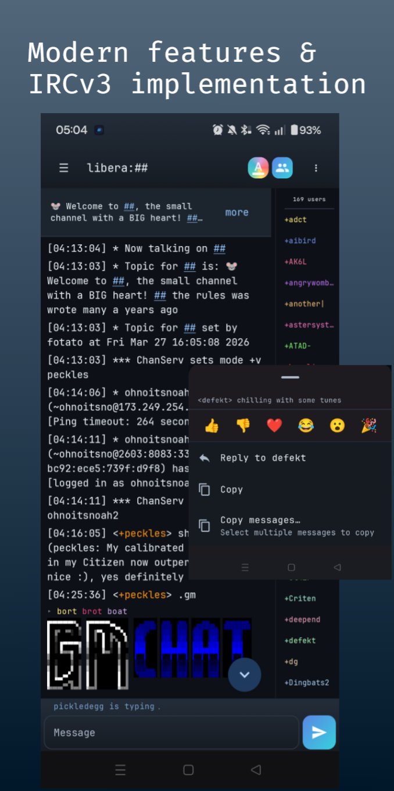
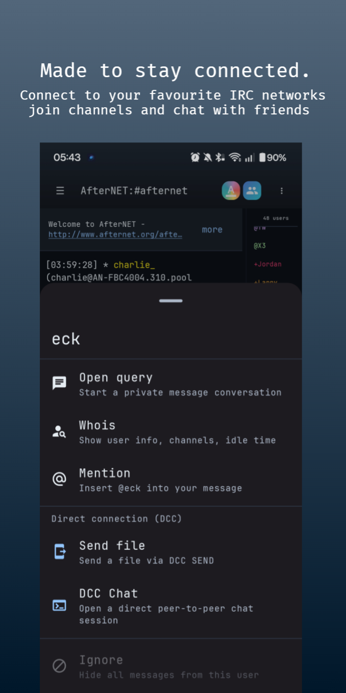
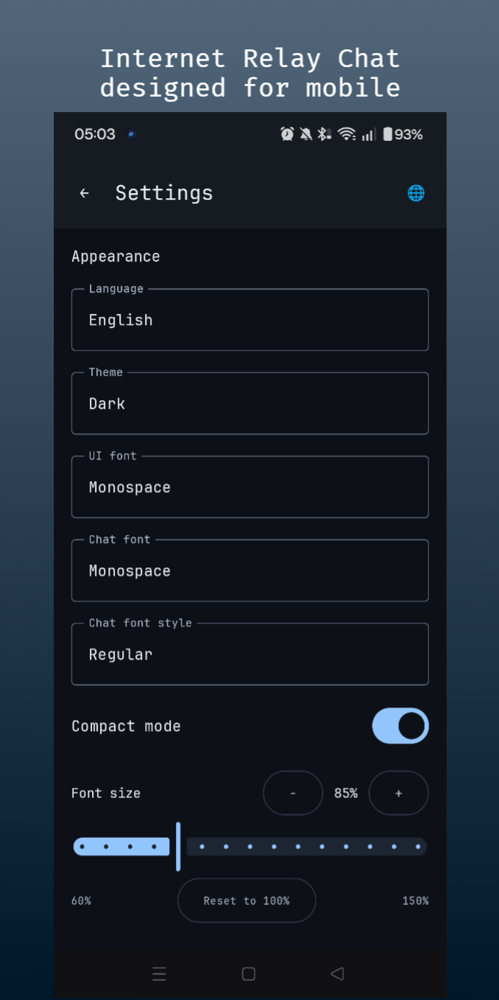

# HexDroid

<div align="center">

[](https://www.gnu.org/licenses/gpl-3.0)
[](https://developer.android.com)
[](https://kotlinlang.org)
[](https://github.com/boxlabss/HexDroid/releases)
[](https://github.com/boxlabss/HexDroid/stargazers)
[](https://github.com/boxlabss/HexDroid/actions)
[](https://shields.rbtlog.dev/com.boxlabs.hexdroid)

**A fast, modern IRC client for Android.**

[Google Play](https://play.google.com/store/apps/details?id=com.boxlabs.hexdroid) &nbsp;·&nbsp; [IzzyOnDroid](https://apt.izzysoft.de/packages/com.boxlabs.hexdroid) &nbsp;·&nbsp; [Direct Download](https://hexdroid.boxlabs.uk/releases/hexdroid-latest.apk) &nbsp;·&nbsp; [Documentation](https://hexdroid.boxlabs.uk/)

</div>

---

HexDroid is a free and open source IRC client for Android. It provides a clean, modern interface while supporting the features users expect from a desktop client — including IRCv3 capabilities, SASL authentication, TLS encryption, bouncer support, DCC file transfers, end-to-end encrypted chat, and an array of commands.

> **Requirements:** Android 8.0 (API 26) or higher &nbsp;·&nbsp; **License:** GPLv3

---

## Screenshots

<div align="center">



</div>

---

## Features

- **Multi-network** — connect to multiple servers simultaneously, each with independent nick, SASL, TLS, autojoin, and encoding settings
- **Bouncer support** supports ZNC and soju. Discover and clone profiles when connecting without a network profile.
- **IRCv3** — 40+ capabilities including `chathistory`, `away-notify`, `server-time`, `echo-message`, `draft/typing`, MONITOR, bouncer-specific caps, and more
- **Secure Chat** — optional end-to-end encryption per channel or PMs: AES-256-GCM (`+AGM`) for HexDroid-to-HexDroid, plus Blowfish/FiSH (`+OK`) for interoperability
- **Security** — TOFU certificate pinning, SASL (PLAIN / SCRAM-SHA-256 / EXTERNAL), client certificates, Android Keystore credential storage
- **irc:// and ircs://** — tapping IRC links in other apps opens HexDroid directly and connects to the target network and channel
- **Localisation** — Arabic, Chinese, Dutch, French, German, Italian, Japanese, Korean, Polish, Portuguese, Russian, Spanish, Turkish

### User Interface

- Material Design 3 with light, dark, and Matrix (green-on-black) themes
- Adjustable font family (Open Sans, Inter, Monospace, custom TTF/OTF) and size, separately for UI and chat
- Inline image and video link previews
- ASCII art rendering with auto-sized MOTD display
- mIRC colour rendering with 99-colour picker + ANSI colour rendering
- Nick `@` autocomplete and `/command` completion with inline hint chips
- Channel op panel: topic, key, user limit; ban/quiet/except/invex list management
- IRCop tools panel (visible when umode `+o`): K/G/D/Z-line, Shun, Kill, SAJoin/SAPart, WALLOPS/GLOBOPS/LOCOPS, MOTD, Links, Uptime
- Per-network ignore list (case-insensitive; covers chat, notices, and DCC offers)
- Channel list with live search and typing indicators displayed per-buffer
- Lag indicator, swipe gestures, compact mode, intro tour for new users
- Backup/restore: network profiles and settings exported as JSON

### Secure Chat (End-to-End Encryption)

HexDroid can encrypt message **content** end-to-end, on top of your TLS connection to the server. TLS protects the link to the server; end-to-end encryption keeps the message text private from the server operator, any bouncer in between, and other channel members who don't hold the key. Configured per channel or per private conversation, off by default.

**Two schemes**, selectable per target in the encryption dialog:

| Scheme | Wire prefix | Indicator | Use it for |
|---|---|---|---|
| **AES-256-GCM** | `+AGM` | 🔒 | The modern default. HexDroid-to-HexDroid (or HexDroid-to-HexChat via the plugin). Authenticated encryption, fresh random nonce per message, channel-bound against cross-channel replay. **Recommended for new conversations.** |
| **Blowfish (FiSH)** | `+OK` | 🐟 | interoperability with HexChat's `fishlim` and other FiSH clients. Reads both ECB and CBC FiSH formats, sends CBC. Use only when the other side can't speak `+AGM`. |

**How it works**

- Keys are **pre-shared** you generate a key on one device and share it with your contact out of band (the in-app **Share** sheet, in person, over another secure messenger). There is no automatic key exchange, so you control exactly who can read the conversation.
- Each key has a short **safety number** (e.g. `K4XR-T9BS`) shown on every device that holds it. Compare it with your contact over a trusted channel to confirm you have the same key and no one tampered with it in transit.
- Encrypted messages show a padlock indicator; a lock badge appears in the input while you're encrypting. Anyone without the key sees only `+AGM <ciphertext>` (or `+OK ...`).
- `/me` actions are encrypted too, with the CTCP framing left intact so non-encrypting clients still render them correctly.

**Key storage & portability**

- Keys are stored on-device in `EncryptedSharedPreferences`, wrapped by the Android Keystore — the same protection used for SASL credentials.
- Keys are **excluded from backups** by design, so they never leave the device in a portable form. After a reinstall or device move you re-share keys with your contacts.

**HexChat interoperability**

- `+AGM`: install the companion `hexdroid_agm.py` plugin (requires the Python `cryptography` package). Adds `/AGM-GEN`, `/AGM-SET`, `/AGM-INFO` and transparent encrypt/decrypt.
- `+OK`: use HexChat's bundled `fishlim` plugin with the same passphrase on both sides.

The plugin and the full `+AGM` wire-format specification are published in this repository so any client author can add `+AGM` support.

> **What it protects:** passive eavesdropping by the server/bouncer/network, other channel members without the key, message tampering (a modified message fails its integrity check), and replay of a ciphertext into another channel.
>
> **What it does *not* protect:** identity (anyone with the key can read and send), forward secrecy (a compromised key exposes past messages), metadata (who talks to whom, and when), or a compromised device. It's a pragmatic upgrade over plaintext IRC and FiSH, not a replacement for Signal. See the [encryption guide](https://hexdroid.boxlabs.uk/encryption).

### IRCv3

HexDroid negotiates a comprehensive set of capabilities. All are enabled by default unless noted.

<details>
<summary><strong>Core message infrastructure</strong></summary>

| Cap | Notes |
|---|---|
| `message-tags` | Base for all tag-based features |
| `server-time` | Timestamps on every message, including history replay |
| `echo-message` + `labeled-response` | Outbound message confirmation; deduplication via msgid |
| `batch` | chathistory, event-playback, and labeled-response grouping |
| `message-ids` | Unique msgid per message; prevents duplicates during chathistory overlap |
| `standard-replies` | Structured FAIL/WARN/NOTE |
| `utf8only` | Signals UTF-8 intent to server |
| `draft/multiline` | When the server supports multiline for messages over 512 bytes |

</details>

<details>
<summary><strong>History &amp; read state</strong></summary>

| Cap | Notes |
|---|---|
| `chathistory` / `draft/chathistory` | Replay on join; BEFORE paging on scroll-to-top; LATEST for unread catch-up |
| `draft/event-playback` | JOIN/PART/MODE events included in history batches |
| `draft/read-marker` / `soju.im/read` | Read pointer sync; drives the unread separator line |

</details>

<details>
<summary><strong>Membership &amp; presence</strong></summary>

| Cap | Notes |
|---|---|
| `away-notify` | `* nick is now away` / `* nick is back` in every shared channel; initial away state seeded from WHOX flags on join |
| `account-notify` | Services login/logout notifications |
| `extended-join` | JOIN line shows `[logged in as account]` for authenticated users |
| `chghost` | Live ident/hostname changes reflected in nicklist |
| `setname` | Receive realname changes; send your own with `/setname` |
| `multi-prefix` | Full mode prefix stack in NAMES (e.g. `@+nick`) |
| `userhost-in-names` | Full `nick!user@host` in NAMES replies (off by default) |
| `invite-notify` | Notifies all channel members of `/invite` |
| `monitor` / `draft/extended-monitor` | Nick watch list; MONONLINE/MONOFFLINE notifications |
| WHOX (005 ISUPPORT) | `WHO %uhsnfar` on join seeds ident, host, account, and initial away state |

</details>

<details>
<summary><strong>Messaging</strong></summary>

| Cap | Notes |
|---|---|
| `account-tag` | Sender account exposed on every PRIVMSG/NOTICE |
| `draft/typing` / `typing` | Composing indicators; sending opt-in (off by default), receiving opt-out |
| `draft/message-reactions` | Emoji reactions via TAGMSG `+draft/react`; displayed as status lines |
| `+draft/reply` / `+reply` | Reply-to msgid threading; forwarded on PRIVMSG and NOTICE |
| `draft/relaymsg` | Relay bot messages attributed to the relayed nick (off by default) |
| `pre-away` / `draft/pre-away` | Sends AWAY before 001 so the session starts marked away when an away message is configured |

</details>

<details>
<summary><strong>Channel management &amp; bouncer / vendor caps</strong></summary>

| Cap | Notes |
|---|---|
| `draft/channel-rename` | Buffer keys, nicklists, and selected buffer all updated on server-issued RENAME |
| `soju.im/bouncer-networks` + `soju.im/bouncer-networks-notify` | Multi-upstream support via soju |
| `soju.im/read` | soju read-marker protocol (parallel to `draft/read-marker`) |
| `soju.im/no-implicit-names` / `draft/no-implicit-names` | Suppress auto-NAMES on JOIN (avoids flood on reconnect) |
| `znc.in/server-time-iso` | Legacy ZNC < 1.7 timestamps |
| `znc.in/playback` | ZNC *playback module for missed-message replay |

</details>

### Character Encoding

Automatic detection starting from UTF-8, with fallback to windows-1251, KOI8-R, ISO-8859-1/15, GB2312, Big5, Shift_JIS, EUC-JP, EUC-KR, and more. Manual override per network for legacy servers.

### DCC

- DCC SEND and DCC CHAT with active, passive, and auto modes
- **Secure DCC** — SSEND and SCHAT for TLS-encrypted file transfers and chat sessions
- Configurable incoming port range and download folder
- Rich transfer progress cards with one-tap accept from notification
- Incoming DCC CHAT offers create a buffer immediately and deep-link from notification

---

## Installation

<table>
<tr>
<td align="center">

**Google Play**

[](https://play.google.com/store/apps/details?id=com.boxlabs.hexdroid)

</td>
<td align="center">

**IzzyOnDroid**

[](https://apt.izzysoft.de/packages/com.boxlabs.hexdroid)

*Available via the [IzzyOnDroid F-Droid repo](https://apt.izzysoft.de/fdroid/). Not yet in the main F-Droid repository.*

</td>
<td align="center">

**Direct APK**

[hexdroid-latest.apk](https://hexdroid.boxlabs.uk/releases/hexdroid-latest.apk)

</td>
</tr>
</table>

**Build from source:**

```bash
git clone https://github.com/boxlabss/hexdroid.git
cd hexdroid
./gradlew assembleRelease
```

---

## Quick Start

1. Tap **Networks → +** and enter a server hostname and port (`6697` for TLS)
2. Set your nickname; optionally configure SASL credentials
3. Save and tap **Connect**
4. Use `/join #channel` or tap **Channel list** to browse

**To encrypt a conversation:** open the channel or DM, tap the overflow menu (⋮) **Secure Chat**, generate a key, and share it with your contact. Import the same key on their device and confirm the safety numbers match. See the [encryption guide](https://hexdroid.boxlabs.uk/encryption.html) for step-by-step instructions.

Full documentation at [hexdroid.boxlabs.uk](https://hexdroid.boxlabs.uk/).

---

## Reproducible Builds

The Play Store and IzzyOnDroid releases are [reproducibly buildable](https://reproducible-builds.org/) — the APK produced from source matches the distributed binary byte-for-byte. The `RB Status` badge above links to the verification record. To verify locally:

```bash
./gradlew assembleRelease
# Compare the output APK against the downloaded release APK
```

---

## Privacy

No ads, analytics, crash reporters, or third-party SDKs. The app communicates only with the IRC servers you configure. All data is stored locally and deleted with the app. End-to-end encryption keys never leave the device. See the full [privacy policy](https://hexdroid.boxlabs.uk/privacy).

---

## Changelog

See [CHANGELOG.md](CHANGELOG.md) for the full version history.

---

## Support

| Where | Link |
|---|---|
| Docs | [hexdroid.boxlabs.uk](https://hexdroid.boxlabs.uk/) |
| Email | android@boxlabs.co.uk |
| IRC | `#HexDroid` on `irc.afternet.org` |

---

## Contributing

Bug reports and pull requests are welcome. Please open an issue before submitting a PR for non-trivial changes.

**Bug reports should include:**

- Device model and Android version
- HexDroid version (Settings → About)
- Steps to reproduce
- Relevant logcat output (Android Studio > Logcat, filter by `hexdroid`)

**Development setup:**

1. Clone the repo and open in Android Studio Meerkat (2024.3) or later
2. Sync Gradle — no additional configuration required
3. Run on a device or emulator with API 26+
4. Tests: `./gradlew test` for unit tests, `./gradlew connectedAndroidTest` for instrumented tests

The HexChat companion plugin and the `+AGM` wire-format specification live under `/aes-client-plugins/hexchat` and `/aes-client-plugins/docs` respectively; client authors wanting to interoperate with HexDroid's encryption should start there.

Translations are managed in the string resources under `app/src/main/res/values-*/`. If your language is missing or incomplete, a PR updating the relevant `strings.xml` is very welcome.

---

## License

```
HexDroid — IRC Client for Android
Copyright (C) 2026 boxlabs

This program is free software: you can redistribute it and/or modify
it under the terms of the GNU General Public License as published by
the Free Software Foundation, either version 3 of the License, or
(at your option) any later version.
```

Full license text in [LICENSE](LICENSE).

---

<div align="center">

*Built with [Kotlin](https://kotlinlang.org/) · [Jetpack Compose](https://developer.android.com/jetpack/compose) · [Material Design 3](https://m3.material.io/)*

</div>
