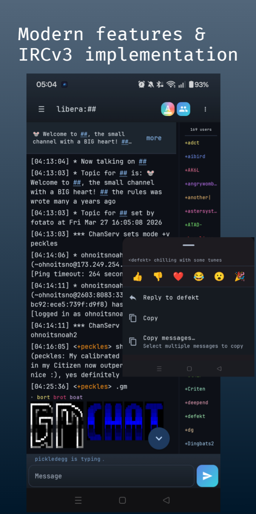
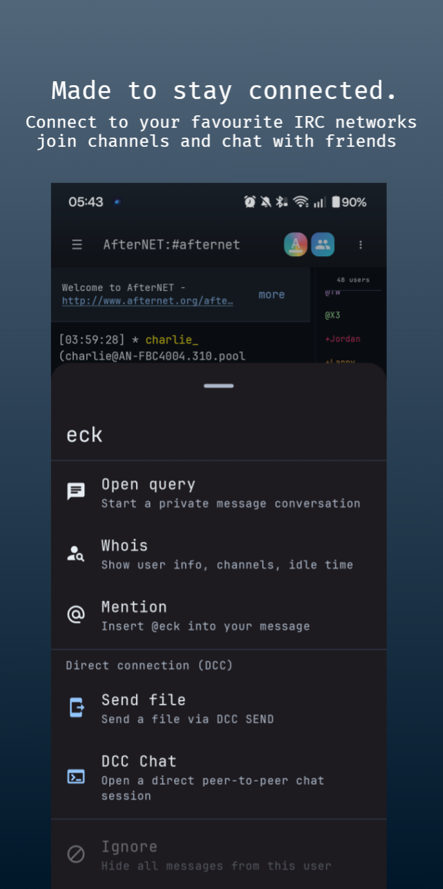
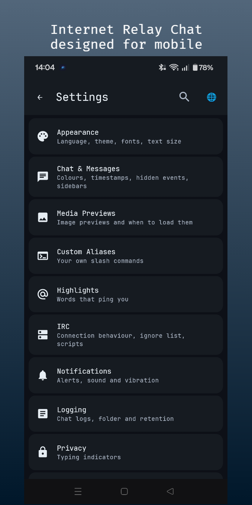

# HexDroid

<div align="center">

[](https://www.gnu.org/licenses/gpl-3.0)
[](https://developer.android.com)
[](https://kotlinlang.org)
[](https://github.com/boxlabss/HexDroid/releases)
[](https://github.com/boxlabss/HexDroid/stargazers)
[](https://github.com/boxlabss/HexDroid/actions)
[](https://shields.rbtlog.dev/com.boxlabs.hexdroid)

**A fast, modern IRC client for Android.**

[Google Play](https://play.google.com/store/apps/details?id=com.boxlabs.hexdroid) &nbsp;·&nbsp; [IzzyOnDroid](https://apt.izzysoft.de/packages/com.boxlabs.hexdroid) &nbsp;·&nbsp; [Direct Download](https://hexdroid.org/releases/hexdroid-latest.apk) &nbsp;·&nbsp; [Documentation](https://hexdroid.org/)

</div>

---

HexDroid is a free and open source IRC client for Android. It provides a clean, modern interface while supporting the features users expect from a desktop client — including IRCv3 capabilities, SASL authentication, TLS encryption, bouncer support, DCC file transfers, end-to-end encrypted chat, TOR, scripting support and an array of commands.

> **Requirements:** Android 8.0 (API 26) or higher &nbsp;·&nbsp; **License:** GPLv3

---

## Screenshots

<div align="center">



</div>

---
## Features
 
- Multiple network profiles, each with its own nick, SASL, TLS, autojoin, and encoding settings
- Tor and SOCKS proxy support
- Comprehensive IRCv3 support
- Bouncer support (ZNC, soju) with profile discovery
- End-to-end encrypted chat per channel/PM: automatic `+AGE`, AES-256-GCM (`+AGM`), and Blowfish/FiSH (`+OK`)
- Scripting engine: sandboxed `.hex` scripts add commands, react to events, draw native UI, and call HTTP APIs
- TOFU certificate pinning, SASL (PLAIN / SCRAM-SHA-256 / EXTERNAL), client certificates
- DCC SEND/CHAT, including TLS-encrypted SSEND/SCHAT. RESUME support for file transfers and IPv6 support
- `irc://` / `ircs://` link handling, image/video previews, mIRC + ANSI colour and ASCII art rendering
- Per-network ignore list, mute list, channel op tools, IRCop panel
- Channel /list, lag indicator, nick `@` and `/command` autocompletion
- Material Design 3 light, dark, and Matrix themes; adjustable fonts; 15 languages
- Backup/restore: network profiles and settings exported as JSON

---

### Documentation

Information about what HexDroid does, including what is available for IRCv3 supported servers, with scripting and troubleshooting guides are available at [hexdroid.org](https://hexdroid.org)

## Installation

<table>
<tr>
<td align="center">

**Google Play**

[](https://play.google.com/store/apps/details?id=com.boxlabs.hexdroid)

</td>
<td align="center">

**IzzyOnDroid**

[](https://apt.izzysoft.de/packages/com.boxlabs.hexdroid)

*Available via the [IzzyOnDroid F-Droid repo](https://apt.izzysoft.de/fdroid/).*

</td>
<td align="center">

**Direct APK**

[hexdroid-latest.apk](https://hexdroid.org/releases/hexdroid-latest.apk)

</td>
</tr>
</table>

**Build from source:**

```bash
git clone https://github.com/boxlabss/hexdroid.git
cd hexdroid
./gradlew assembleRelease
```
---

## Quick Start

1. Tap **Networks** and the **+ button** to enter a server hostname and port (`6697` for TLS)
2. Set your nickname; optionally configure SASL credentials
3. Save and tap **Connect**
4. Use `/join #channel` or tap **Channel list** to browse

**To encrypt a conversation:** open the channel or DM, tap the overflow menu (⋮) **Secure Chat**, generate a key, and share it with your contact. Import the same key on their device and confirm the safety numbers match. See the [encryption guide](https://hexdroid.org/encryption) for step-by-step instructions.

---

## Privacy

No ads, analytics, crash reporters, or third-party SDKs. The app communicates only with the IRC servers you configure. All data is stored locally and deleted with the app. End-to-end encryption keys never leave the device. See the full [privacy policy](https://hexdroid.org/privacy).

---

## Changelog

See [CHANGELOG.md](CHANGELOG.md) for the full version history.

---

## Support

| Where | Link |
|---|---|
| Email | android@boxlabs.co.uk |
| IRC | [ircs://irc.afternet.org:6697/HexDroid](ircs://irc.afternet.org:6697/HexDroid) |

---

## Contributing

Bug reports and pull requests are welcome. Please open an issue before submitting a PR for non-trivial changes.

**Bug reports should include:**

- Device model and Android version
- HexDroid version (Settings → About)
- Steps to reproduce
- Relevant logcat output (Android Studio > Logcat, filter by `hexdroid`)

**Developers:**

Plugins for E2E +AGM encryption are available for some desktop and a terminal client in `/aes-client-plugins`
The docs for both +AGM and +AGE are in `/docs` and client authors wanting to interoperate with HexDroid's encryption should start there.

Translations are managed in the string resources under `app/src/main/res/values-*/`. If your language is missing or incomplete, a PR updating the relevant `strings.xml` is very welcome.

---

## Reproducible Builds

The Play Store and IzzyOnDroid releases are [reproducibly buildable](https://reproducible-builds.org/). The `RB Status` badge above links to the verification record.

To verify locally:

```bash
# 1. Build from a clean checkout. No KEYSTORE_* variables set.
./gradlew clean assembleRelease
#    -> app/build/outputs/apk/release/app-release-unsigned.apk

# 2. Fetch the published APK you want to check against.
curl -LO https://hexdroid.org/releases/hexdroid-latest.apk

# 3. Compare. apksigcopier's "compare" does this properly: it copies the signature across and diffs everything else.
pip install apksigcopier
apksigcopier compare hexdroid-latest.apk --unsigned \
    app/build/outputs/apk/release/app-release-unsigned.apk
```

A clean run prints nothing and exits 0. For a byte-level look at any difference, `diffoscope` over the two APKs is the usual next step.

Building a signed release requires all four of `KEYSTORE_FILE`, `KEYSTORE_PASSWORD`, `KEY_ALIAS` and `KEY_PASSWORD`. Setting only some of them fails the build. Automated or scripted release builds should pass `-PrequireSigning=true`, which fails the build if nothing will sign the output, so a misconfigured runner cannot quietly produce an unsigned APK.

---

## License

```
This program is free software: you can redistribute it and/or modify
it under the terms of the GNU General Public License as published by
the Free Software Foundation, either version 3 of the License, or
(at your option) any later version.
```

Full license text in [LICENSE](LICENSE).

---

<div align="center">

*Built with [Kotlin](https://kotlinlang.org/) · [Jetpack Compose](https://developer.android.com/jetpack/compose) · [Material Design 3](https://m3.material.io/)*

</div>
